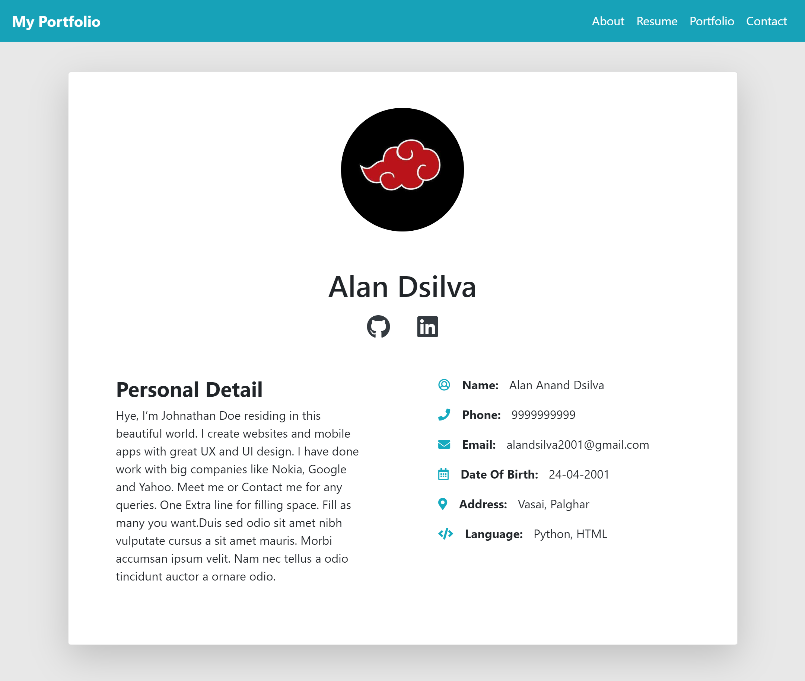
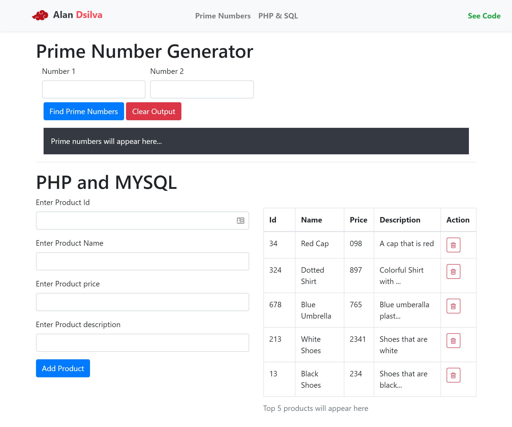

# Sem5-webDevCourse

### Index
* [Assignment 1.2](#Assignment-1.2)
  - [View live](https://alandsilva26.github.io/Sem5-webDevCourse/Assignment-1.2/index.html)
  - [View code](https://github.com/DeathBringer269/Sem5-webDevCourse/tree/master/Assignment-1.2)
* [Assignment 2](#Assignment-2)
  - [View live](https://deathbringer269.github.io/Sem5-webDevCourse/Assignment-2/index.html)
  - [View code](https://github.com/DeathBringer269/Sem5-webDevCourse/tree/master/Assignment-2)
* [Assignment 3](#Assignment-3)
  - [View live](https://deathbringer269.github.io/Sem5-webDevCourse/Assignment-3/index.html)
  - [View code](https://github.com/DeathBringer269/Sem5-webDevCourse/tree/master/Assignment-3)
* [Assignment 4](#Assignment-4)
  - [View live](https://github.com/DeathBringer269/Sem5-webDevCourse/tree/master/Assignment-4/readme.md)
  - [View code](https://github.com/DeathBringer269/Sem5-webDevCourse/tree/master/Assignment-4)
* [Assignment 5](#Assignment-5)
  - [View live](https://deathbringer269.github.io/Sem5-webDevCourse/Assignment-5/index.html)
  - [View code](https://github.com/DeathBringer269/Sem5-webDevCourse/tree/master/Assignment-5)

## [Assignment 1.2](https://deathbringer269.github.io/Sem5-webDevCourse/Assignment-1.2/index.html)

## [Assignment 2](https://deathbringer269.github.io/Sem5-webDevCourse/Assignment-2/index.html)

## [Assignment 3](https://deathbringer269.github.io/Sem5-webDevCourse/Assignment-3/index.html)

## [Assignment 4](https://github.com/DeathBringer269/Sem5-webDevCourse/blob/master/Assignment-4/readme.md)

## [Assignment 5](https://deathbringer269.github.io/Sem5-webDevCourse/Assignment-5/index.html)

